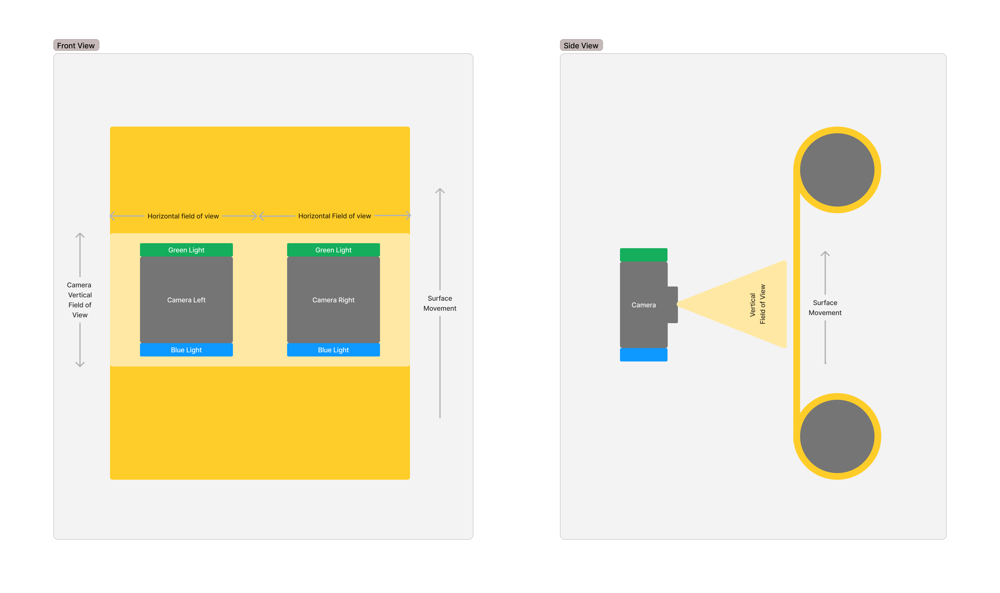

# Python Test - Weaving Analyzer

## Test description

### Objective:
You are tasked with developing a program designed for surface inspection, ensuring precise monitoring and synchronization of cameras, lighting, and surface movement.

This program not only needs to get images (from simulated camera controllers) and surface velocity (from simulated velocity controllers),
will also need to send this data to a server that will analyse it. 


### Inspection System Overview:

**The inspection system comprises:**
- **Two cameras**: placed on front of the surface.
 - **A moving surface**: Ascending vertically (vertical axes of the cameras).
   - The horizontal field of both cameras combined, covers the whole surface horizontally (60 cm).
   - Vertical field of view of the cameras: 25 cm.
   - Horizontal field of view of the cameras: 33 cm.
 - **Two light types**: (Green and Blue) that can be flashed by the cameras.

The inspection mechanism is depicted on the following diagram:



***

### Requirements

1. **Velocity and Displacement Measurement**

   - Use the Velocity Sensor Controller provider to measure surface simulated velocity.
   - Address noise in velocity readings with at least 50 samples per second and filtering for smoother data.
   - Calculate surface displacement based on velocity.
   
2. **Camera Triggering Frequency**
   - Determine the optimal frequency for camera iterations.
   - Each iteration should trigger both light types (Green and Blue), minimizing displacement between their respective images.
   - Consider a batch of pictures valid only if it contains data from both light types, with the order being irrelevant.
   - Clarification:  the pictures of each light type need to be taken sequentially and then wait for the
right amount of fabric to pass to start another iteration

3. **Multithreaded Image Sending**
   - Implement a multithreading approach to efficiently send images to the server.
   
4. **Logging System**
   - Create a comprehensive logging system to provide insights into program operation (hint: use debug levels carefully)

5. **Testing and Documentation:**
   - Develop tests for each functionality.
   - Ensure the documentation of your code


***

## Controllers

Two hardware controller simulators are available for program implementation:

### Cameras Controller
Controller to take pictures with the provided fake cameras.
This controller has three available public methods:
- `open_cameras()`
  - Prepares the cameras to be ready to use.
- `trigger()`
  - Triggers the cameras shutter.  
- `collect_pictures()`
  - Collects the pictures that were taken previously from all cameras.

### Velocity Sensor Controller
Controller to get the surface linear velocity in centimeters per minute (cm/min).
This controller has three available public methods:
- `start_sensor()`
  - Starts the velocity sensor.
- `stop_sensor()`
  - Stops the velocity sensor.
- `get_velocity()`
  - Gets the current surface planar velocity.

***

## Server
You have an available server to send the information that you obtain with your program.
The server will operate locally in the address `127.0.0.1:5000` and has the next set of endpoints.
> NOTE: It is up to you to select how to send the data to the server, for example, you can encode using JSON standard,
> but JSON do not support all the data that you need to send to the server. The person that implemented the server
> expects a well-specified body, but they will implement the encoder/decoder selected by you.

- `/ping`
  - Available methods: GET
- `/pictures_batch` 
  - Available methods: POST
  - Expected body example:
    ```json
    {
      "lights": [
        {
          "light": "blue_light",
          "creation_date": "2023-08-31 15:43:28.416324",
          "surface_velocity": 0.123,
          "surface_displacement":  1.152,
          "pictures": {
            "left": {
              "picture": "picture binary blue-left",
              "iso": 100,
              "exposure_time": 0.005,
              "diaphragm_opening": 2.8
            },
            "right": {
              "picture": "picture binary blue-right",
              "iso": 200,
              "exposure_time": 0.01,
              "diaphragm_opening": 2.8
            }
          } 
        },
        {
          "light": "green_light",
          "creation_date": "2023-08-31 15:43:31.214121",
          "surface_velocity": 0.12,
          "surface_displacement":  0.189,
          "pictures": {
            "left": {
              "picture": "picture binary green-left",
              "iso": 50,
              "exposure_time": 0.02,
              "diaphragm_opening": 4
            },
            "right": {
              "picture": "picture binary green-right",
              "iso": 200,
              "exposure_time": 0.005,
              "diaphragm_opening": 1.8
            }
          } 
        }
      ]
    }
    ```
- `/surface_movement`
  - Available methods: POST
  - Expected body example:
    ```json
    {
      "velocity": 0.123,
      "displacement": 4.431
    }
    ```
  
***

